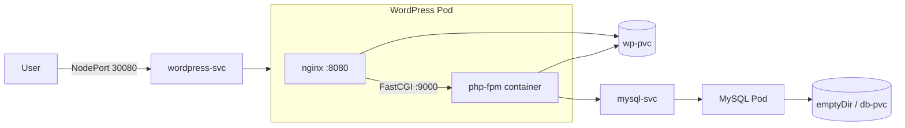

# Workshop: Deploying WordPress (PHP 8.5-FPM) on OpenShift Local (CRC)
### Static PV/PVC + NodePort Exposure — Pure YAML

---

## 1. Overview

In this workshop you will deploy a full WordPress stack on **OpenShift CRC (OpenShift Local)** using:

- **`wordpress:php8.5-fpm`** — the official WordPress image running PHP-FPM only (no built-in web server)
- **NGINX** sidecar container — required because PHP-FPM speaks FastCGI, not HTTP, so it cannot serve browser requests on its own
- **MySQL 8** — the WordPress database backend
- **Static PersistentVolume + PersistentVolumeClaim** — manually provisioned storage (no StorageClass / dynamic provisioning)
- **Service of type `NodePort`** — the YAML equivalent of `oc expose`, used to reach WordPress from outside the cluster

> **Why NGINX is required:** `wordpress:php8.5-fpm` only exposes port `9000` (FastCGI). Without a front-end web server proxying `.php` requests to that port, there is nothing to point a browser or NodePort at. This workshop wires the two containers together in a single Pod sharing the WordPress filesystem via the same PVC.

### Architecture



---

## 2. Prerequisites

| Requirement | Notes |
|---|---|
| CRC installed and started | `crc setup && crc start` |
| `oc` CLI on PATH | `eval $(crc oc-env)` |
| Logged in to CRC | `oc login -u developer -p developer https://api.crc.testing:6443` |
| A free directory on the CRC VM host | Used as the static PV's `hostPath` |

Confirm CRC is healthy:

```bash
crc status
oc whoami
oc version
```

---

## 3. Create the Project (Namespace)

```yaml
# 00-namespace.yaml
apiVersion: project.openshift.io/v1
kind: Project
metadata:
  name: wp-workshop
  labels:
    app: wordpress
```

Apply it:

```bash
oc apply -f 00-namespace.yaml
oc project wp-workshop
```

---

## 4. Static Storage: PersistentVolume + PersistentVolumeClaim

CRC runs as a single-node VM, so a `hostPath`-backed PV is the simplest way to demonstrate **static** provisioning (no StorageClass, no dynamic binding logic — you create the PV yourself and the PVC binds to it by matching size/access mode).

### 4.1 PersistentVolume (cluster-scoped)

```yaml
# 01-pv.yaml
apiVersion: v1
kind: PersistentVolume
metadata:
  name: wp-pv
  labels:
    type: local
spec:
  capacity:
    storage: 2Gi
  accessModes:
    - ReadWriteOnce
  persistentVolumeReclaimPolicy: Retain
  storageClassName: manual
  hostPath:
    path: "/mnt/data/wordpress"
```

> `storageClassName: manual` is what keeps this **static** — it deliberately does not match any dynamic provisioner, so the PVC below binds directly to this PV instead of triggering automatic provisioning.

### 4.2 PersistentVolumeClaim (namespaced)

```yaml
# 02-pvc.yaml
apiVersion: v1
kind: PersistentVolumeClaim
metadata:
  name: wp-pvc
  namespace: wp-workshop
spec:
  accessModes:
    - ReadWriteOnce
  storageClassName: manual
  resources:
    requests:
      storage: 2Gi
```

Apply and verify binding:

```bash
oc apply -f 01-pv.yaml
oc apply -f 02-pvc.yaml
oc get pv wp-pv
oc get pvc wp-pvc -n wp-workshop
```

Expected status: `Bound` for both.

> **CRC node permission note:** `hostPath` volumes are written by the container's UID. If you see permission-denied errors from `php-fpm`/`nginx`, relax the SCC for this namespace's default service account (acceptable for a workshop, not for production):
> ```bash
> oc adm policy add-scc-to-user anyuid -z default -n wp-workshop
> ```

---

## 5. Database Layer: Secret + MySQL Deployment + Service

### 5.1 Secret for credentials

```yaml
# 03-mysql-secret.yaml
apiVersion: v1
kind: Secret
metadata:
  name: mysql-secret
  namespace: wp-workshop
type: Opaque
stringData:
  MYSQL_ROOT_PASSWORD: RootPass123!
  MYSQL_DATABASE: wordpress
  MYSQL_USER: wpuser
  MYSQL_PASSWORD: WpUserPass123!
```

### 5.2 MySQL Deployment

```yaml
# 04-mysql-deployment.yaml
apiVersion: apps/v1
kind: Deployment
metadata:
  name: mysql
  namespace: wp-workshop
  labels:
    app: mysql
spec:
  replicas: 1
  selector:
    matchLabels:
      app: mysql
  template:
    metadata:
      labels:
        app: mysql
    spec:
      containers:
        - name: mysql
          image: mysql:8.0
          ports:
            - containerPort: 3306
          envFrom:
            - secretRef:
                name: mysql-secret
          volumeMounts:
            - name: db-storage
              mountPath: /var/lib/mysql
      volumes:
        - name: db-storage
          emptyDir: {}
```

> For a fully persistent DB, repeat the PV/PVC pattern from Section 4 (separate `db-pv` / `db-pvc`) and mount that PVC instead of `emptyDir`. It is kept as `emptyDir` here to keep the workshop focused on the WordPress static volume.

### 5.3 MySQL Service (ClusterIP — internal only)

```yaml
# 05-mysql-service.yaml
apiVersion: v1
kind: Service
metadata:
  name: mysql-svc
  namespace: wp-workshop
spec:
  selector:
    app: mysql
  ports:
    - port: 3306
      targetPort: 3306
  type: ClusterIP
```

Apply:

```bash
oc apply -f 03-mysql-secret.yaml
oc apply -f 04-mysql-deployment.yaml
oc apply -f 05-mysql-service.yaml
oc get pods -n wp-workshop -l app=mysql -w
```

---

## 6. NGINX Configuration for PHP-FPM

Since `wordpress:php8.5-fpm` has no web server, this ConfigMap supplies the NGINX virtual host that proxies PHP requests to the FPM container over FastCGI on `127.0.0.1:9000`.

```yaml
# 06-nginx-configmap.yaml
apiVersion: v1
kind: ConfigMap
metadata:
  name: nginx-conf
  namespace: wp-workshop
data:
  default.conf: |
    server {
        listen 8080;
        root /var/www/html;
        index index.php index.html;

        location / {
            try_files $uri $uri/ /index.php?$args;
        }

        location ~ \.php$ {
            fastcgi_pass 127.0.0.1:9000;
            fastcgi_index index.php;
            fastcgi_param SCRIPT_FILENAME $document_root$fastcgi_script_name;
            include fastcgi_params;
        }

        location ~ /\.ht {
            deny all;
        }
    }
```

---

## 7. WordPress Deployment (php-fpm + nginx, sharing the static PVC)

```yaml
# 07-wordpress-deployment.yaml
apiVersion: apps/v1
kind: Deployment
metadata:
  name: wordpress
  namespace: wp-workshop
  labels:
    app: wordpress
spec:
  replicas: 1
  selector:
    matchLabels:
      app: wordpress
  template:
    metadata:
      labels:
        app: wordpress
    spec:
      containers:
        - name: php-fpm
          image: wordpress:php8.5-fpm
          ports:
            - containerPort: 9000
          env:
            - name: WORDPRESS_DB_HOST
              value: mysql-svc:3306
            - name: WORDPRESS_DB_NAME
              valueFrom:
                secretKeyRef:
                  name: mysql-secret
                  key: MYSQL_DATABASE
            - name: WORDPRESS_DB_USER
              valueFrom:
                secretKeyRef:
                  name: mysql-secret
                  key: MYSQL_USER
            - name: WORDPRESS_DB_PASSWORD
              valueFrom:
                secretKeyRef:
                  name: mysql-secret
                  key: MYSQL_PASSWORD
          volumeMounts:
            - name: wp-storage
              mountPath: /var/www/html

        - name: nginx
          image: nginx:1.27-alpine
          ports:
            - containerPort: 8080
          volumeMounts:
            - name: wp-storage
              mountPath: /var/www/html
            - name: nginx-conf
              mountPath: /etc/nginx/conf.d/default.conf
              subPath: default.conf

      volumes:
        - name: wp-storage
          persistentVolumeClaim:
            claimName: wp-pvc
        - name: nginx-conf
          configMap:
            name: nginx-conf
```

Apply:

```bash
oc apply -f 06-nginx-configmap.yaml
oc apply -f 07-wordpress-deployment.yaml
oc get pods -n wp-workshop -l app=wordpress -w
```

Both containers (`php-fpm`, `nginx`) should reach `Running` / `2/2 Ready`.

---

## 8. Expose WordPress via NodePort (YAML equivalent of `oc expose`)

```yaml
# 08-wordpress-service-nodeport.yaml
apiVersion: v1
kind: Service
metadata:
  name: wordpress-svc
  namespace: wp-workshop
  labels:
    app: wordpress
spec:
  type: NodePort
  selector:
    app: wordpress
  ports:
    - name: http
      port: 8080
      targetPort: 8080
      nodePort: 30080
```

> Declaring `type: NodePort` (with an optional fixed `nodePort` in the 30000–32767 range) is the manifest equivalent of running `oc expose deployment/wordpress --type=NodePort --port=8080`. Both end up creating the same kind of Service object.

Apply:

```bash
oc apply -f 08-wordpress-service-nodeport.yaml
oc get svc wordpress-svc -n wp-workshop
```

---

## 9. Access WordPress

Get the CRC node IP and confirm the NodePort:

```bash
oc get nodes -o wide
oc get svc wordpress-svc -n wp-workshop
```

Browse to:

```
http://<CRC-NODE-IP>:30080
```

You should land on the WordPress installation screen. Complete the setup wizard using the `MYSQL_USER` / `MYSQL_PASSWORD` values from the Secret (already wired in automatically — WordPress will detect the existing database connection).

> If `crc status` reports an IP that isn't directly reachable from your host, use:
> ```bash
> oc get route -n wp-workshop 2>/dev/null || echo "Using NodePort directly via CRC IP"
> crc ip
> ```

---

## 10. Verification Checklist

```bash
oc get pv,pvc -n wp-workshop
oc get deployment -n wp-workshop
oc get pods -n wp-workshop -o wide
oc get svc -n wp-workshop
oc describe pvc wp-pvc -n wp-workshop
oc logs deployment/wordpress -c php-fpm -n wp-workshop
oc logs deployment/wordpress -c nginx -n wp-workshop
```

| Check | Expected Result |
|---|---|
| PV status | `Bound` |
| PVC status | `Bound` |
| WordPress pod | `2/2 Running` |
| MySQL pod | `1/1 Running` |
| `wordpress-svc` | `NodePort` with port `30080` listed |
| Browser at `http://<CRC-IP>:30080` | WordPress setup / login screen |

---

## 11. Cleanup

```bash
oc delete -f 08-wordpress-service-nodeport.yaml
oc delete -f 07-wordpress-deployment.yaml
oc delete -f 06-nginx-configmap.yaml
oc delete -f 05-mysql-service.yaml
oc delete -f 04-mysql-deployment.yaml
oc delete -f 03-mysql-secret.yaml
oc delete -f 02-pvc.yaml
oc delete -f 01-pv.yaml
oc delete -f 00-namespace.yaml
```

> Because the PV's `persistentVolumeReclaimPolicy` is `Retain`, data under `/mnt/data/wordpress` on the CRC VM survives PVC/PV deletion until manually removed.

---

